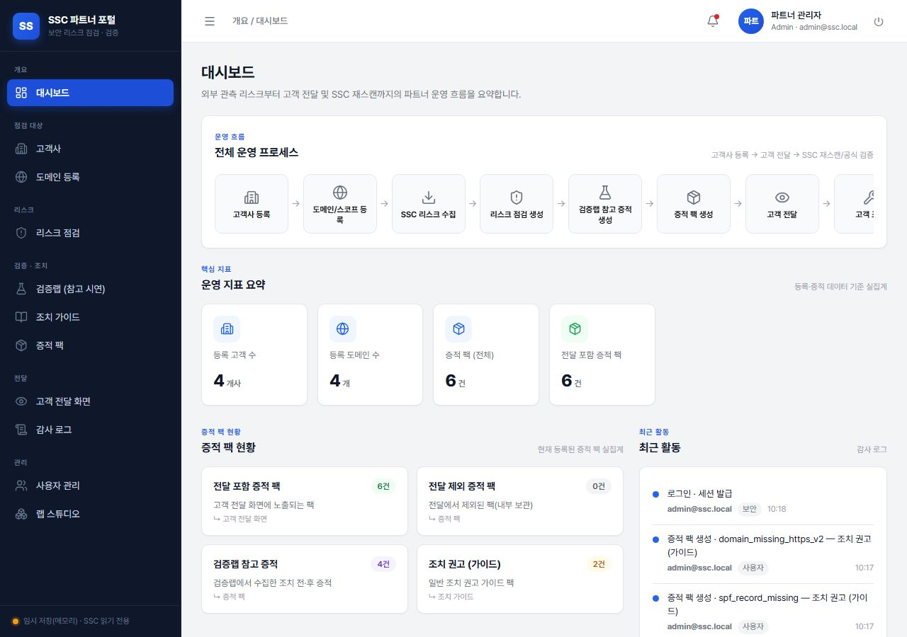
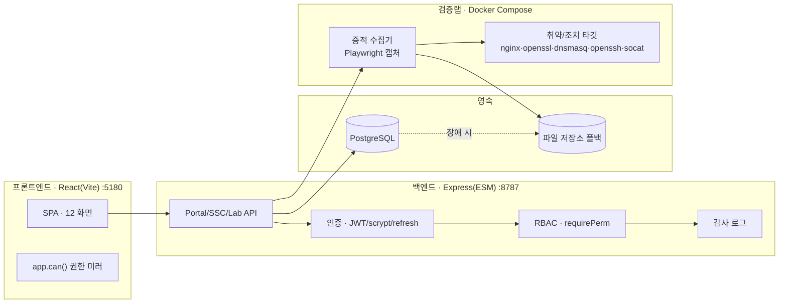

# SSC Partner Portal

> 외부 보안 관측(SecurityScorecard) 리스크를 **수집 → 검증랩 재현 → 증적 팩 → 고객 리포트 전달까지 잇는 풀스택 파트너 보안 운영 포털.
> 개인 프로젝트** — 실제 회사·고객·도메인 정보는 데모 샘플로 치환했습니다.

 -3c873a)   



> 전체 화면(12개)의 정의·기능·역할·연결·API는 **[화면정의서 →](docs/SCREENS.md)**

---

## 무엇을 만들었나

보안 파트너사가 고객 도메인의 **외부 관측 보안 리스크**를 정리하고, **표준 검증랩**에서 같은 문제의 조치 전·후를 재현해 증적을 만들고, 이를 **고객 리포트**로 전달하기까지의 전 과정을 하나의 시스템으로 구현했습니다.

- **프론트엔드** React(Vite) SPA — 대시보드부터 고객 전달 리포트까지 12개 화면
- **백엔드** Express(ESM) — 무거운 의존성 없이 직접 구현한 인증·권한·감사·영속 계층
- **검증랩** Docker 격리 스택 — 5개 카테고리 50종 취약 유형을 실제 명령으로 재현하고 증적 캡처
- **데이터** PostgreSQL(+파일 저장소 폴백)

## 왜 (해결한 문제)

외부 스캐너는 "무엇이 취약한지"만 알려줍니다. 파트너는 그걸 **고객이 이해하고 조치할 수 있는 증적·리포트**로 바꿔야 합니다. 이 포털은 그 간극 — 리스크 관측과 고객 전달 사이 — 을 자동화합니다. 핵심은 **"자동화가 만든 증적이 진짜인지"를 사람이 독립적으로 검증**할 수 있게 만든 것입니다.

---

## 핵심 하이라이트 (엔지니어링)

| 영역 | 내용 |
|---|---|
| **의존성 최소 인증** | JWT(HS256) 수동 서명 · scrypt 비밀번호 · Refresh 토큰 **회전 + 재사용 탐지**(httpOnly 쿠키). 외부 auth 라이브러리 없이 Node `crypto`만으로 구현 |
| **RBAC** | `admin·partner·viewer` 3역할. 권한 매트릭스를 **백엔드에서 강제**(`requirePerm`)하고 프론트가 `app.can()`으로 미러링 — UI 게이팅과 API 방어 이중화 |
| **실 감사 로그** | 사용자·시스템·보안 이벤트를 분리 기록(로그인·권한 거부·DB 폴백 등). **민감값(토큰·비밀번호)은 미기록**. Postgres + 파일 폴백 |
| **SSC 기반 AI Lab Builder** | LLM은 **레시피(JSON 데이터)만** 생성 → **결정적 렌더러**가 실제 환경 구성 → **검증 게이트** 통과 시 채택. LLM이 실행 코드를 만들지 않는 신뢰 경계 설계 |
| **검증랩 50종** | HTTP 헤더·TLS·DNS·네트워크·SSH 5개 카테고리. Docker 격리 타깃 + Playwright로 조치 전·후 증적 캡처 |
| **수동 검증 하니스** | 자동화와 **독립적으로** 사람이 스크립트를 돌려 실제 운영자 조치를 재현: 취약 환경 생성 → 조치 적용 → ①취약 해소 ②**서비스 무해**(웹 200/DNS 응답/SSH KEX)까지 검증. `verify.sh --all` → **50/50 PASS** |
| **전달 시점 증적 재촬영** | 고객 전달 시 증적을 **그 자리에서 실시간 캡처**. 실제 `curl` 응답의 `Date` 헤더를 촬영 시각(KST)으로 명시해 최신성 보장 |
| **리포트 파이프라인** | 우선순위 표 + 이슈별 조치 전·후 상세 → **PDF 인쇄** + **mailto 전달**(자격증명 미보관) |

---

## 아키텍처



**운영 흐름**: 고객사 등록 → 도메인/스코프 → SSC 리스크 수집 → 검증랩 조치 전·후 재현 → 증적 팩 → 고객 전달 리포트(PDF/메일) → SSC 재스캔으로 공식 해소 확인.

자세한 설계는 [docs/ARCHITECTURE.md](docs/ARCHITECTURE.md), 전체 화면 정의는 [화면정의서](docs/SCREENS.md) 참조.

---

## 기술 스택

- **Frontend** React 18 · Vite · 순수 CSS(디자인 토큰) · 자체 컴포넌트
- **Backend** Node.js · Express(ESM) · Node `crypto`(JWT/scrypt) — 인증·권한·감사·영속을 외부 프레임워크 없이 구현
- **Data** PostgreSQL 16 (문서형 저장 + 파일 폴백)
- **Lab** Docker Compose — nginx · openssl · dnsmasq · openssh · socat 타깃 + Playwright 수집기
- **검증 하니스** POSIX sh 스크립트(reproduce/remediate) + 카테고리별 가변 drill 컨테이너

## 실행 방법

> 사전 요구: Node 18+, Docker Desktop

```bash
# 1) 검증랩 스택 (Docker)
cd lab && docker compose up -d

# 2) 백엔드 (:8787)
cd backend && cp .env.example .env && npm install && npm run dev

# 3) 프론트엔드 (:5180)
npm install && npm run dev
```

기본 관리자 시드: `admin@ssc.local` / `ssc-demo-1234` (개발 전용 — 프로덕션은 `SEED_ADMIN_PASSWORD`·`AUTH_ACCESS_SECRET` 필수 교체, 미설정 시 부팅 차단).

```bash
# 수동 검증 하니스 (검증랩이 떠 있는 상태에서)
sh lab/verify/verify.sh --all      # 50종 취약 재현→조치→해소·무해 검증
```

---

## 보안 · 설계 원칙

- **비밀키는 `.env`에만** — 응답·로그·감사에 노출 금지. `.env`는 gitignore.
- **컴플라이언스 조항 표기는 예시**(ISMS-P·PCI·ISO 27001 등) — 관련성 참고이며 감사 판정이 아님.
- **검증랩 증적 = 참고 PoC** — 고객 운영환경의 실제 해소를 의미하지 않으며, 공식 확인은 SecurityScorecard 재스캔.
- 프로덕션 기본 시크릿 사용 시 **부팅 차단**(기본 관리자 탈취·JWT 위조 방지).

## 디렉터리

```
├─ src/            프론트엔드 (React) — pages·features·components·lib
├─ backend/        Express API — auth·authz·audit·portal·lab·ssc
├─ lab/            검증랩 Docker 스택
│  ├─ targets/     취약/조치 & 가변 drill 타깃
│  ├─ evidence-collector/  Playwright 증적 수집기
│  └─ verify/      수동 검증 하니스 (issues/ 50종)
└─ docs/           설계 문서 · 화면정의서
```

---

## 역할

기획·설계·구현 전반을 단독으로 진행한 풀스택 프로젝트입니다. 인증/권한/감사 같은 보안 기반 계층을 외부 프레임워크에 기대지 않고 직접 설계했고, "자동으로 만든 증적을 사람이 독립적으로 검증한다"는 원칙 아래 검증랩과 수동 검증 하니스(50/50)를 함께 구축했습니다.

## 면책

본 저장소는 **포트폴리오/데모** 목적입니다. 실제 회사·고객·도메인·보안 관측 데이터는 모두 데모 샘플(Acme·Globex·`demo-commerce.example.com` 등)로 치환했으며, 어떤 실제 조직의 보안 현황도 담고 있지 않습니다.
