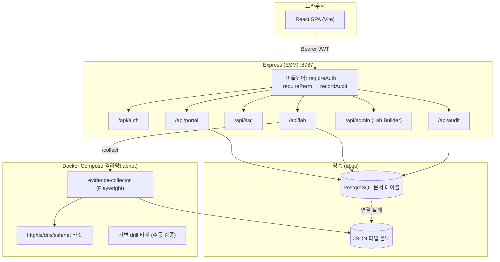
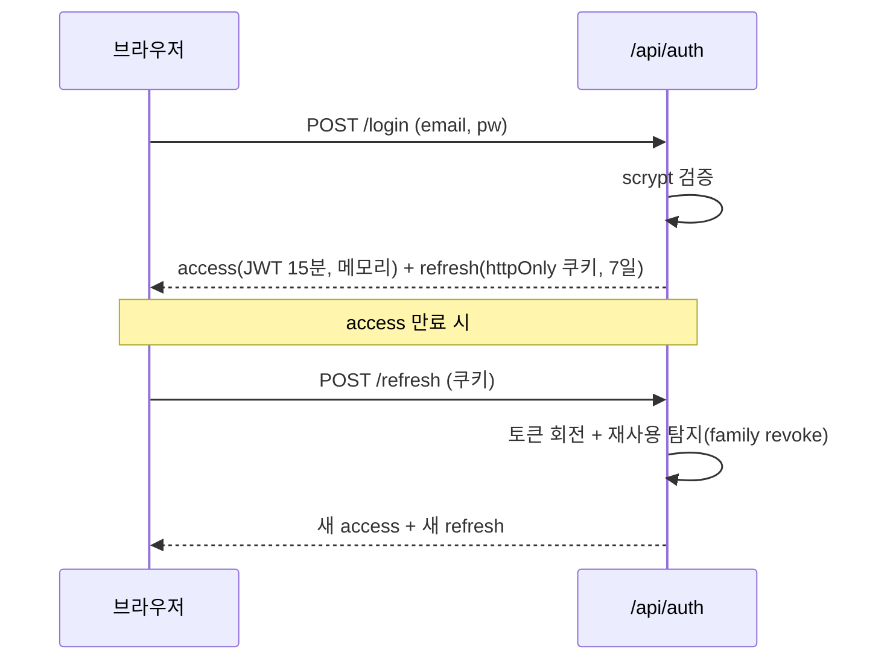
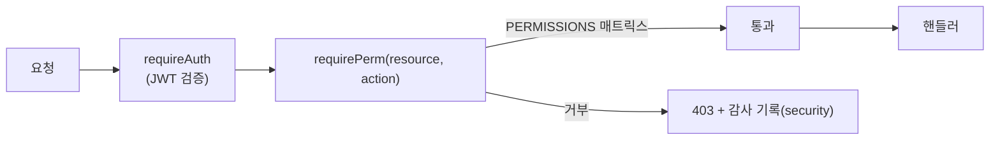
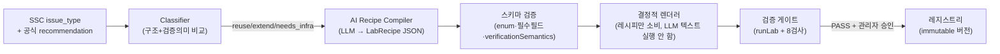
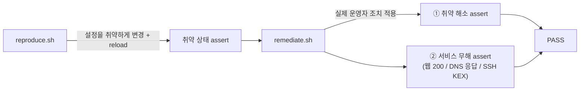

# 아키텍처

SSC Partner Portal의 설계 결정과 주요 서브시스템을 정리합니다. (포트폴리오/데모)

## 1. 전체 구성

**설계 원칙**: 백엔드가 신뢰 경계의 중심. 프론트는 UX를 위해 권한을 미러링하지만, 모든 강제는 서버에서. 검증랩은 격리 네트워크(labnet)로 고객 도메인/인터넷과 분리.

## 2. 인증 · 세션

외부 auth 라이브러리 없이 Node `crypto`로 구현.

- **Access**: HS256 JWT 수동 서명, 15분, 프론트 메모리 보관(XSS 노출 최소화).
- **Refresh**: 랜덤 opaque, httpOnly 쿠키(`Path=/api/auth`), 회전식. 재사용이 감지되면 같은 family 전체 폐기 → 탈취 대응.
- **부팅 가드**: 프로덕션에서 기본 시크릿/기본 관리자 비밀번호면 `process.exit(1)`.

## 3. 권한 (RBAC)

- `PERMISSIONS`: `resource → {read, write} → 허용 역할` 매트릭스(단일 소스).
- `admin`=전체, `partner`=고객사·도메인·증적·랩 쓰기, `viewer`=읽기 전용.
- 프론트: 로그인 응답의 `permissions`로 `app.can(resource, action)` → 쓰기 버튼 게이팅.
- **이중 방어**: UI가 숨겨도 API가 다시 막고, 거부는 보안 감사로 남김.

## 4. 감사 로그

- 3종 분리: `user`(CRUD·전달), `security`(로그인·권한 거부), `system`(서버 시작·DB 폴백).
- `recordAudit({kind, actor, action, target, result, ip})` — fire-and-forget.
- **민감값 미기록**: 토큰·비밀번호는 상태/식별자만.
- 저장: `audit_log` 문서 테이블(Postgres) + `audit-store.json` 폴백(상한 2000).

## 5. SSC 기반 AI Lab Builder (신뢰 경계)

새 취약 유형이 추가돼도 사람이 5계층을 손으로 고치지 않도록 반자동 생성. **LLM이 실행 코드를 만들지 않는 것**이 핵심.

- LLM 출력 = **스키마 고정 레시피(데이터)**. 코드·Dockerfile·collector JS 생성 없음.
- 재사용 판정은 이름 유사도가 아니라 **구현 구조 + 검증 의미**(`verificationSemantics`)로 — 예: HSTS(존재+max-age)와 CSP(정책 분석)는 둘 다 헤더지만 검증 의미가 달라 자동 재사용 금지.
- 채택은 게이트 PASS + 관리자 승인 후 **불변 버전**으로만.

## 6. 검증랩 · 증적 수집

- 카테고리별 **취약 타깃 / 조치 타깃** 2개를 두고, 수집기가 실제 명령(`curl -sSI`, `openssl s_client`, `dig`, `nmap`, `ssh`)을 날려 조치 전·후를 관측.
- Playwright가 명령 출력(응답 헤더 등)을 **터미널 화면 스크린샷**으로 렌더 → 증적 PNG.
- 아티팩트는 named volume에 영속 → 재빌드에도 유지.

### 전달 시점 재촬영 & 실촬영 시각

증적을 미리 굽지 않고 **전달하는 순간 새로 촬영**. 이미지의 근거 시각은 실제 `curl` 응답의 `Date` 헤더(서버 응답 시각)를 파싱해 KST로 명시 → "언제 찍은 증적인가"가 위·변조 없이 드러남.

## 7. 수동 검증 하니스 (독립 검증)

자동화(collector)가 만든 증적의 **전제가 진짜인지**를 사람이 독립적으로 확인하는 계층. 자동화 코드를 호출하지 않는 것이 핵심(순환 검증 방지).

- **가변 drill 타깃**: 카테고리별 nginx·openssl·dnsmasq·openssh·socat 컨테이너를 런타임에 조작.
- `reproduce`가 매번 취약 베이스라인을 세우므로 (reproduce→remediate) 쌍은 **멱등**.
- `verify.sh <issue> | --all` → 카테고리별 target 컨테이너로 자동 라우팅. 현재 **50/50 PASS**.
- 자동 게이트(`labValidationGate`, collector 출력 검사)와 **보완 관계** — 이쪽은 컨테이너를 직접 찔러 전제를 확인.

## 8. 영속 (Postgres + 파일 폴백)

- `db.js` 문서 저장소: `DOC_TABLES` 화이트리스트, `isDbEnabled()`.
- Postgres 연결 실패 시 자동으로 JSON 파일 저장소로 폴백하고 **그 사실을 system 감사로 기록** → 관측 가능.

---

## 주요 설계 트레이드오프

| 결정 | 이유 |
|---|---|
| auth를 직접 구현 | 의존성·공격면 축소 + 세션 회전/재사용 탐지를 명시적으로 통제 |
| 2-컨테이너 관측(자동) vs 단일 가변(수동) | 자동 증적은 재현성(멱등) 우선, 수동 검증은 실제 운영자 경험(상태 전이) 우선 — 목적이 달라 분리 |
| LLM은 레시피만 | 신뢰 경계: 생성물이 데이터면 스키마·게이트로 통제 가능, 실행 코드면 불가 |
| 파일 저장소 폴백 | 데모/개발에서 DB 없이도 동작 + 장애를 감사로 가시화 |
