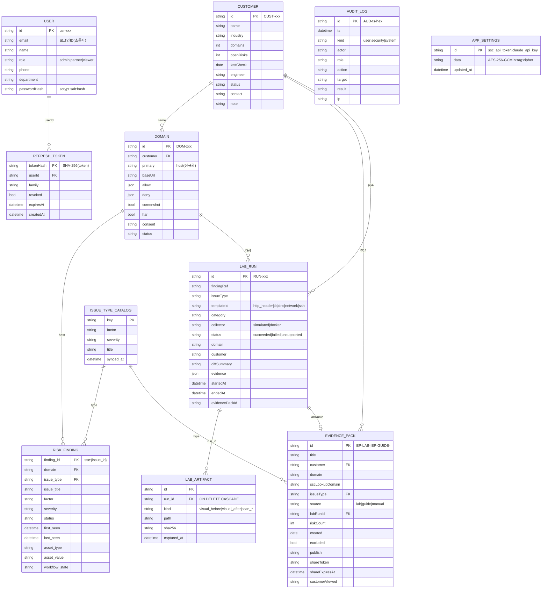

# 데이터베이스 설계서 (ERD · 테이블 명세)

SSC 파트너 포털의 영속 계층 설계 문서. 개발자 인수인계 · 스키마 변경 관리의 단일 참조.

> 예시 값은 모두 데모 데이터(Acme/Globex/Sample)입니다 — 실 고객·도메인·시크릿을 포함하지 않습니다.

---

## 1. 영속 구조 개요 (이원 모델)

이 프로젝트는 **두 가지 영속 모델이 공존**한다. 목적이 다르므로 혼동하지 말 것.

| 구분 | 운영 저장소 (실사용) | 관계형 스키마 (리포팅 타깃) |
|------|----------------------|------------------------------|
| 위치 | [`backend/src/db.js`](../backend/src/db.js) 의 **JSONB 문서 스토어** | [`db/schema.sql`](../db/schema.sql) 의 정규화 테이블 |
| 형태 | `(id TEXT PK, data JSONB, updated_at)` 제네릭 테이블 10종 | 컬럼 정규화 테이블 6종 |
| 스키마 근원 | store 모듈의 **JS 객체 형태**(코드가 SSOT) | DDL(컬럼·타입·제약) |
| 현재 역할 | **런타임 주 저장소** — 모든 읽기/쓰기 | 향후 리포팅/집계 쿼리용으로 유지(런타임 미사용) |
| 미연결 시 | **파일 저장소로 자동 폴백**(`backend/data/*.json`) — 앱 무중단 | — |

### 폴백(파일 저장소)
Postgres 연결 실패 시 각 store는 `backend/data/<name>.json` 파일로 폴백한다(`isDbEnabled()===false`). 개발 로컬·DB 장애 시 앱이 죽지 않게 하는 장치이며, 데이터 형태는 DB의 `data` JSONB와 동일하다.

```
연결 시도(2.5s) ─┬─ 성공 → Postgres 문서 스토어(10 테이블 CREATE IF NOT EXISTS)
                 └─ 실패 → 파일 폴백(backend/data/*.json)
```

---

## 2. ERD — 논리 모델 (운영 엔티티)

문서 스토어에서 관계는 **자연 키(이름·호스트·id 문자열)로 논리적으로만** 연결된다(제약으로 강제되지 않음). 아래는 논리적 관계.



> 관계는 자연 키(이름·호스트·id 문자열)로 **논리 연결**되며 DB 제약으로 강제되지 않는다. 유일한 강제 FK는 관계형 스키마의 `LAB_ARTIFACT.run_id → LAB_RUN.id`(CASCADE).
> 위에 없는 **GUIDE_INTERPRETATION**(Claude 해석 캐시)·**LAB_RECIPE**(AI 레시피 레지스트리)는 관계 없는 독립 JSONB 테이블 — 상세는 §3.9·§3.10.

---

## 3. 운영 저장소 테이블 명세 (JSONB 문서 스토어)

각 테이블 물리 구조는 동일하다: **`id TEXT PRIMARY KEY`, `data JSONB NOT NULL`, `updated_at TIMESTAMPTZ DEFAULT now()`**.
아래 "필드"는 `data` JSONB 안의 JS 객체 형태(코드가 SSOT). 문서 키(`id` 컬럼)와 객체의 `id`가 다를 수 있는 경우 별도 표기.

### 3.1 `auth_users` — 사용자
문서 키 = `email`(소문자). 정의: [`authStore.js`](../backend/src/authStore.js) · [`auth.js`](../backend/src/auth.js)

| 필드 | 타입 | 제약/기본 | 설명 |
|------|------|-----------|------|
| id | string | `usr-{hex}` (관리자=`usr-admin`) | 내부 식별자(불변) |
| email | string | 필수·유일·소문자 | 로그인 ID, 문서 키 |
| name | string | 필수 | 표시 이름 |
| role | string | `admin`\|`partner`\|`viewer` | 역할(권한 매트릭스 근거) |
| phone | string\|null | 기본 null | 연락처 |
| department | string\|null | 기본 null | 소속 |
| passwordHash | string | 필수 | **scrypt** `salt:hash`(N=64B). 평문 미저장 |

> `permissions`는 저장하지 않고 `role`에서 런타임 파생(`permsForRole`). 응답에는 `passwordHash` 제외(`publicUser`).

### 3.2 `auth_refresh_tokens` — refresh 세션
문서 키 = `tokenHash`. 회전(rotation)·재사용 탐지용.

| 필드 | 타입 | 설명 |
|------|------|------|
| tokenHash | string (PK) | SHA-256(refresh token). **원문 미저장** |
| userId | string | → `auth_users.id` |
| family | string | 회전 그룹 식별자(재사용 감지 시 family 전체 폐기) |
| expiresAt | string(ISO) | 만료 시각(기본 TTL은 코드 상수) |
| revoked | boolean | 폐기 여부 |
| createdAt | string(ISO) | 발급 시각 |

> `pruneExpired()`로 만료분 정리. 비밀번호 변경/재설정 시 `revokeAllForUser`로 전 세션 폐기.

### 3.3 `portal_customers` — 고객사
문서 키 = `id`. 정의: [`portalStore.js`](../backend/src/portalStore.js)

| 필드 | 타입 | 설명 |
|------|------|------|
| id | string (PK) | `CUST-xxx` |
| name | string | 고객사명 — **도메인·증적팩이 참조하는 자연 키** |
| industry | string | 산업군 |
| domains | int | 도메인 수(요약값) |
| openRisks | int | 오픈 리스크 수(요약값) |
| lastCheck | string(date) | 최근 점검일 |
| engineer | string | 담당 엔지니어 |
| status | string | `Active`\|`Review`\|`Suspended` 등 |
| contact | string | 담당자 연락처 |
| note | string | 메모 |

### 3.4 `portal_domains` — 점검 도메인
문서 키 = `id`.

| 필드 | 타입 | 설명 |
|------|------|------|
| id | string (PK) | `DOM-xxx` |
| customer | string | → `portal_customers.name` |
| primary | string | 호스트명(스킴/포트/경로 제거 정규화) |
| baseUrl | string? | 접속 기준 URL |
| allow | string[] | 점검 허용 URL 패턴 |
| deny | string[] | 점검 제외 URL 패턴 |
| screenshot | boolean | 스크린샷 저장 허용 |
| har | boolean | HAR 저장 허용 |
| consent | string | 동의 상태 |
| status | string | `In Scope`\|`Pending Consent`\|`Restricted` 등 |

> 관계형 스키마(`db/schema.sql`)에서는 `primary_domain`/`allow_urls`/`deny_urls`(snake_case)로 대응.

### 3.5 `portal_evidence_packs` — 증적 팩(고객 전달 단위)
문서 키 = `id`.

| 필드 | 타입 | 설명 |
|------|------|------|
| id | string (PK) | `EP-LAB-…`(검증랩) \| `EP-GUIDE-…`(조치 권고) |
| title | string | 팩 제목 |
| customer | string | → 고객사명 |
| domain | string | 대상 도메인 |
| sscLookupDomain | string | SSC 조회 기준 호스트 |
| issueType | string | 이슈 유형 키 |
| source | string | `lab`\|`guide`\|`manual` |
| labRunId | string? | → `lab_runs_doc.id`(source=lab) |
| riskCount | int | 연결 리스크 수 |
| created | string(date) | 생성일 |
| excluded | boolean | 고객 전달에서 제외 여부 |
| publish | string | `발행됨`일 때만 게시 링크 열람 허용 |
| shareToken | string? | 고객 게시 링크 토큰(`#share=`) |
| shareExpiresAt | string(ISO)? | 게시 링크 만료(기본 30일) |
| customerViewed | string | `열람`\|`미열람` |

### 3.6 `lab_runs_doc` — 검증랩 재현 실행
문서 키 = `id`. 정의: [`lab.js`](../backend/src/lab.js) (관계형 `lab_runs`와 이름 충돌 방지 위해 `_doc` 접미).

| 필드 | 타입 | 설명 |
|------|------|------|
| id | string (PK) | `RUN-xxx` |
| findingRef | string? | 연결된 SSC finding |
| issueType | string | 이슈 유형 |
| templateId | string | `http_header`\|`tls`\|`dns`\|`network`\|`ssh` |
| category | string | 분류 |
| evidenceMode | string | `web_screenshot`\|`scan_report` |
| tool | string | 수집 도구 |
| collector | string | `simulated`\|`docker` |
| status | string | `succeeded`\|`failed`\|`unsupported` |
| domain / customer | string | 대상·귀속 |
| serviceEndpoint / sscLookupDomain | string? | 서비스 주소·조회 기준 |
| diffSummary | string | 조치 전/후 요약 |
| guide / logs / disclaimers | JSON | 조치 가이드 · 실행 로그 · 고지 |
| evidence | JSON | `visual_before`/`visual_after`/`technical_diff` 등 증적 |
| startedAt / endedAt | string(ISO) | 실행 구간 |
| evidencePackId | string? | 파생 증적 팩 |

### 3.7 `audit_log` — 감사 로그(append-only)
문서 키 = `id`. 정의: [`auditStore.js`](../backend/src/auditStore.js)

| 필드 | 타입 | 설명 |
|------|------|------|
| id | string (PK) | `AUD-{ts}-{hex}` |
| ts | string(ISO) | 발생 시각 |
| kind | string | `user`(사용자 행위) \| `security`(인증·권한) \| `system`(운영) |
| actor | string | 행위자(이메일 또는 `system`) |
| role | string\|null | 행위자 역할 |
| action | string | 행위 설명 |
| target | string\|null | 대상 식별자 |
| result | string | `OK`\|`Created`\|`Failed` 등 |
| ip | string\|null | 클라이언트 IP(리버스프록시 뒤 실 IP) |

> **민감값 절대 미기록** — 토큰·비밀번호 등은 남기지 않고 상태·대상 식별자만. 파일 폴백 시 최근 `FILE_CAP=2000`건 유지.

### 3.8 `app_settings` — 앱 설정(암호화)
문서 키 = 설정 키. 정의: [`settingsStore.js`](../backend/src/settingsStore.js)

| 문서 키(id) | data 내용 | 설명 |
|-------------|-----------|------|
| `ssc_api_token` | AES-256-GCM 블롭 | SecurityScorecard API 토큰(관리자 설정) |
| `claude_api_key` | AES-256-GCM 블롭 | Claude API 키(Lab Builder용) |

> **평문 미저장** — `data`는 `iv:authTag:ciphertext`(hex) 형식. KEK는 `AUTH_ACCESS_SECRET`에서 용도별 salt로 파생(SSC 토큰 ≠ Claude 키). KEK 근원이 코드 기본값이면 민감 키의 DB 저장을 차단(취약 파생 방지). 상태 API는 `****last4` + 출처만 반환.

### 3.9 `guide_interpretations` — 조치 가이드 해석 캐시
문서 키 = 이슈/가이드 키. Claude 해석 결과(JSON) 캐시. 정의: [`guideInterpret.js`](../backend/src/guideInterpret.js)

### 3.10 `lab_recipes` — AI Lab 레시피 레지스트리
문서 키 = 레시피 id. 정의: [`labRecipes.js`](../backend/src/labRecipes.js)

| 필드 | 설명 |
|------|------|
| schemaVersion, issueType, version | immutable 버전(같은 issueType도 `v1/v2/v3` 보존) |
| archetype, protocol, targetEngine | 렌더 대상 구조 |
| verificationSemantics | **1급 필드** — 검증 의미(kind/header/before/after). classifier·gate 통제 근거 |
| guide, catalog, sourceDiff, collectorAssertion | 가이드·카탈로그·소스 diff·수집 assertion |
| generator | `{provider, model, generatedAt}` |
| status | `candidate`\|`active`\|`archived` (채택본만 active) |

---

## 4. 관계형 스키마 (리포팅 타깃 · `db/schema.sql`)

향후 리포팅/집계 쿼리용으로 유지되는 정규화 스키마. **현재 런타임 주 저장소는 아니다**(위 문서 스토어가 실사용).
문서 스토어와 이름이 겹치지 않도록 런타임은 `lab_runs_doc`을 쓰고, 여기 `lab_runs`는 정규화판이다.

| 테이블 | PK | 주요 컬럼 | 인덱스 |
|--------|-----|-----------|--------|
| `customers` | id | name, industry, domains, open_risks, last_check, engineer, status, contact, note, created_at, updated_at | — |
| `domains` | id | customer, primary_domain, base_url, allow_urls(JSONB), deny_urls(JSONB), screenshot, har, consent, status | `idx_domains_customer(customer)` |
| `risk_findings` | finding_id | source, scorecard_identifier, domain, issue_type, issue_title, factor, severity, status, first_seen, last_seen, asset_type, asset_value, evidence_summary, recommendation_summary, workflow_state, collected_at | `idx_findings_domain(domain)`, `idx_findings_issue_type(issue_type)` |
| `issue_type_catalog` | key | factor, severity, title, synced_at | — |
| `lab_runs` | id | finding_ref, issue_type, template_id, category, evidence_mode, tool, collector, status, domain, customer, diff_summary, guide(JSONB), logs(JSONB), disclaimers(JSONB), started_at, ended_at, evidence_pack_id | `idx_lab_runs_issue_type(issue_type)` |
| `lab_artifacts` | id | **run_id → lab_runs(id) ON DELETE CASCADE**, kind, path, sha256, captured_at | `idx_artifacts_run(run_id)` |

> `lab_artifacts.run_id`가 이 스키마의 **유일한 강제 FK**(CASCADE). 나머지 관계는 자연 키.

---

## 5. 키·관계 요약

| 관계 | 연결 방식 | 강제 여부 |
|------|-----------|-----------|
| domain → customer | `customer` = customer.name | 논리(미강제) |
| risk_finding → domain | `domain` = domain.primary(host) | 논리 |
| risk_finding → issue_type_catalog | `issue_type` = key | 논리 |
| lab_run → domain/customer | 이름/호스트 | 논리 |
| evidence_pack → lab_run | `labRunId` = run.id | 논리 |
| refresh_token → user | `userId` = user.id | 논리 |
| lab_artifact → lab_run | `run_id` FK | **강제(관계형 스키마만)** |

문서 스토어는 관계 무결성을 **애플리케이션 레벨**에서 보장한다(자연 키 매칭). 정규화·FK 강제가 필요하면 §4 관계형 스키마로 이행이 다음 단계.

---

## 6. 마이그레이션 · 변경 관리

- **스키마 진화**: 문서 스토어는 JSONB라 컬럼 마이그레이션이 없다. 필드 추가/변경은 store 모듈 코드에서 하며, 하위호환 기본값으로 흡수한다(예: `phone`/`department`는 없으면 null).
- **파일 → DB 이관**: DB 최초 연결 시 비어 있으면 파일 데이터를 1회 이관(`migrateAuthIfEmpty`, `seedPortalIfEmpty`, `seedAuditIfEmpty`). refresh 토큰은 휘발성이라 이관 생략.
- **관계형 스키마 적용**: `db/schema.sql`은 `CREATE TABLE IF NOT EXISTS` — 초기화 스크립트로 멱등 적용 가능.
- **버전 불변(레시피)**: `lab_recipes`는 같은 issueType도 버전 누적 보존, 채택본만 `status='active'`.

---

## 7. 보안 설계 노트

- **비밀번호**: scrypt(`salt:hash`)만 저장 — 평문·가역 암호 없음.
- **refresh 토큰**: 원문 미저장, SHA-256 해시만. 회전 + family 재사용 탐지.
- **설정 시크릿**(SSC 토큰·Claude 키): AES-256-GCM 암호화 저장, 평문·전체값 미반환(상태는 `****last4`).
- **감사 로그**: 토큰·비밀번호 등 민감값 미기록(상태·대상 식별자만).
- **전송 암호화**: `PGSSL=true` 시 Postgres 연결 TLS(배포). 상세는 [`backend/DEPLOY_SECURITY.md`](../backend/DEPLOY_SECURITY.md).

---

## 관련 문서
- 시스템 아키텍처: [`docs/ARCHITECTURE.md`](ARCHITECTURE.md)
- 배포 가이드: [`deploy/README.md`](../deploy/README.md)
- 배포 보안 체크리스트: [`backend/DEPLOY_SECURITY.md`](../backend/DEPLOY_SECURITY.md)
- API 명세(OpenAPI): 관리자 화면 · `/api/admin/openapi.json`
