# 화면정의서 (Screen Definition)

SSC Partner Portal의 전체 화면 정의입니다. **실제 동작 화면 캡처**를 기준으로 화면별 정의·기능·역할·연결·컴포넌트·API를 정리했습니다.

> 모든 스크린샷은 **데모 데이터**(Acme Electronics · Globex Insurance · `www.example.co.kr` 등)로 캡처했습니다.
> 설계 상세는 [ARCHITECTURE.md](ARCHITECTURE.md) 참조.

## 역할 범례

| 역할 | 권한 |
|---|---|
| `admin` | 전체 (사용자 관리·감사 로그·랩 스튜디오 포함) |
| `partner` | 고객사·도메인·증적·검증랩 쓰기 |
| `viewer` | 읽기 전용 |

권한은 백엔드에서 강제(`requirePerm`)하고 프론트가 `app.can()`으로 미러링합니다.

## 운영 흐름

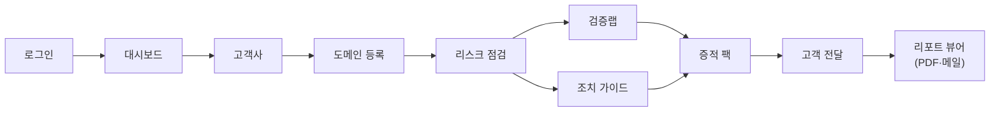

관리 화면(감사 로그 · 사용자 관리 · 랩 스튜디오)은 이 흐름과 별개인 관리자 전용 도구입니다.

---

## SCR-00 · 로그인

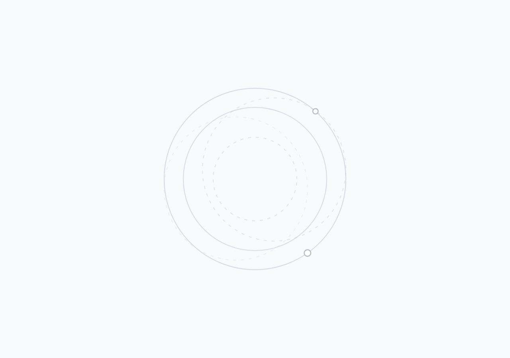

이메일·비밀번호로 파트너 계정에 로그인합니다. 미인증 상태로 어떤 경로에 접근해도 이 화면으로 유도됩니다.

- **주요 기능** 이메일·비밀번호 입력 · 로그인 · 자격 오류 안내
- **역할** 전체(미인증)
- **연결** → 대시보드
- **Component** `LoginView` · `src/features/Login.jsx`
- **API** `POST /api/auth/login` · `POST /api/auth/refresh`(세션 복원, httpOnly 쿠키)

---

## SCR-01 · 대시보드

외부 관측 리스크부터 고객 전달·SSC 재스캔까지 파트너 운영 흐름을 요약합니다. 지표·증적 팩 현황·최근 활동은 **실데이터 실집계**입니다(목업 없음).

- **주요 기능** 운영 프로세스 단계 클릭 이동 · 핵심 지표(고객·도메인·증적 팩) · 증적 팩 현황 · 최근 활동(실제 감사 로그)
- **역할** 전체
- **연결** ← 로그인 / → 고객사·도메인·리스크·검증랩·증적 팩·고객 전달
- **Component** `Dashboard` · `src/pages/Pages.jsx`
- **API** app 상태 재사용 · `GET /api/audit`

---

## SCR-02 · 고객사

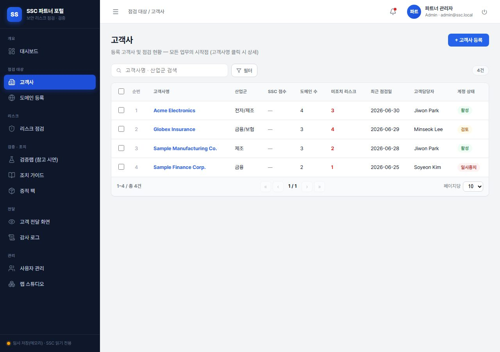

검증 대상 고객사를 등록·조회·관리합니다. 파트너 운영의 출발점입니다.

- **주요 기능** 고객사 등록 위저드 · 목록 검색/필터 · 상세·수정 · 일괄 삭제(관리자)
- **역할** 조회 `전체` / 쓰기 `admin` `partner`
- **연결** ← 대시보드 / → 도메인 등록
- **Component** `Customers` · `src/pages/Pages.jsx`
- **API** `GET/POST/PUT/DELETE /api/portal/customers`

---

## SCR-03 · 도메인 등록

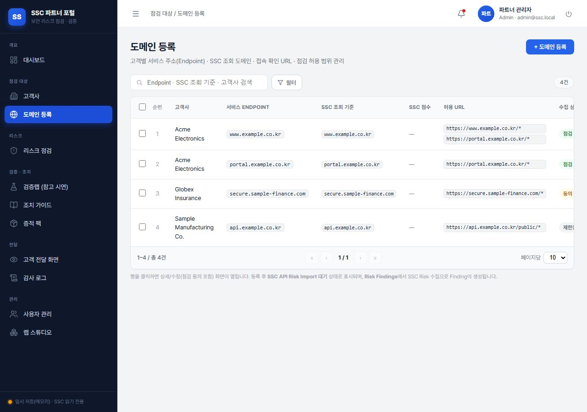

고객사별 서비스 도메인과 점검 스코프(SSC 조회 기준·포트·허용/차단 경로)를 등록합니다.

- **주요 기능** 도메인 등록·수정 모달 · Endpoint/SSC 조회 기준/포트 지정 · 검색·필터
- **역할** 조회 `전체` / 쓰기 `admin` `partner`
- **연결** ← 고객사 / → 리스크 점검
- **Component** `Domains` · `src/pages/Pages.jsx`
- **API** `GET/POST/PUT/DELETE /api/portal/domains`

---

## SCR-04 · 리스크 점검

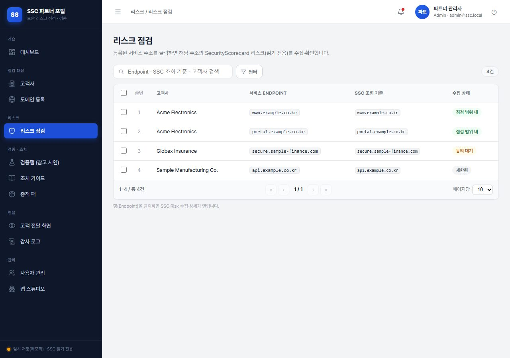

등록 도메인의 SecurityScorecard 외부 관측 리스크를 수집·확인합니다(읽기 전용). 행을 클릭하면 우측 드로어에서 수집·상세가 열립니다.

- **주요 기능** 서비스 주소 클릭 → 드로어에서 SSC 리스크 수집 · 우선순위/위험도 · CSV 내보내기
- **역할** 조회 `전체`
- **연결** ← 도메인 등록 / → 조치 가이드 · 검증랩
- **Component** `RiskFindings` + `EndpointRiskDrawer` · `src/pages/Pages.jsx`
- **API** `/api/ssc/*` (SSC 리스크 수집)

---

## SCR-05 · 검증랩 (참고 시연)

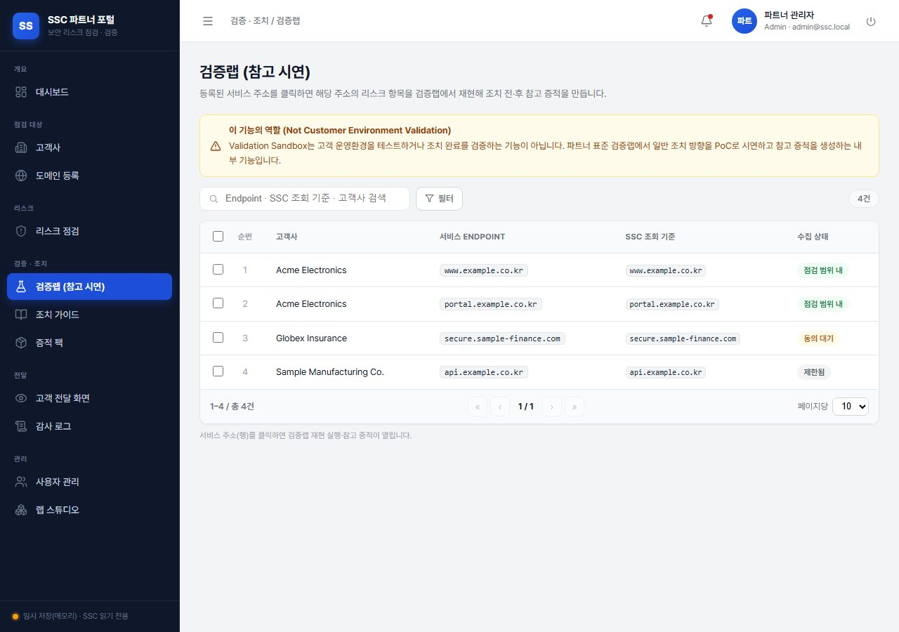

issue_type을 선택해 표준 검증랩을 실행하고 **조치 전·후 참고 증적**을 생성합니다. 참고용 PoC이며 고객 환경의 조치 완료를 의미하지 않습니다(실제 해소는 SSC 재스캔으로 확인).

- **주요 기능** 이슈 유형 선택·랩 실행 · 조치 전/후 캡처 증적 · 증적 팩(초안)에 추가
- **역할** 조회 `전체` / 실행 `admin` `partner`
- **연결** ← 리스크 점검 / → 증적 팩
- **Component** `ValidationSandbox` · `src/features/Lab.jsx`
- **API** `GET /api/lab/templates` · `POST /api/lab/runs` · `GET /api/lab/artifact`

---

## SCR-06 · 조치 가이드

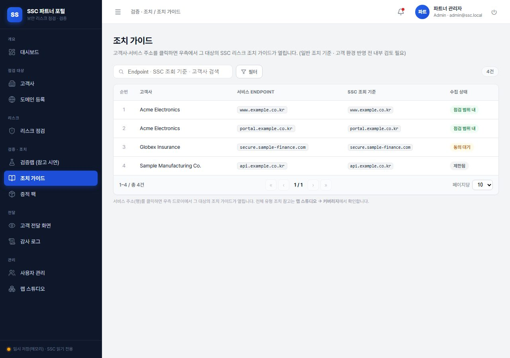

이슈 유형별 표준 조치 가이드(스텝별)·엔진별 설정 예시·컴플라이언스 참조를 제공합니다.

- **주요 기능** 이슈 선택·스텝 가이드 · 엔진(nginx·Apache 등) 탭 · 쉬운말 해석 · 증적 팩에 추가
- **역할** 조회 `전체`
- **연결** ← 리스크 점검 / → 증적 팩
- **Component** `RemediationGuides` · `src/pages/Pages.jsx`
- **API** `POST /api/guides/interpret`(선택)

---

## SCR-07 · 증적 팩

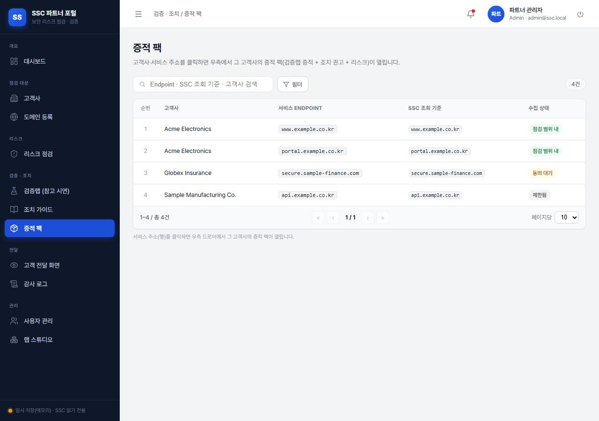

고객사별 증적 팩(검증랩 증적 · 조치 권고 · 리스크)을 관리합니다. 고객사를 클릭하면 우측 드로어에서 해당 고객사의 팩이 열리고, 선택해 일괄 작업(전달 포함/제외·삭제)할 수 있습니다.

- **주요 기능** 고객사 클릭 → 드로어 · 일괄 작업(전달 포함/제외·삭제) · 고객 게시 링크 발급 · 팩 상세
- **역할** 조회 `전체` / 쓰기 `admin` `partner`
- **연결** ← 검증랩·조치 가이드 / → 고객 전달
- **Component** `EvidencePacks` + `EndpointPacksDrawer` · `src/pages/Pages.jsx`
- **API** `GET/POST/PUT/DELETE /api/portal/evidence-packs`

---

## SCR-08 · 고객 전달 화면

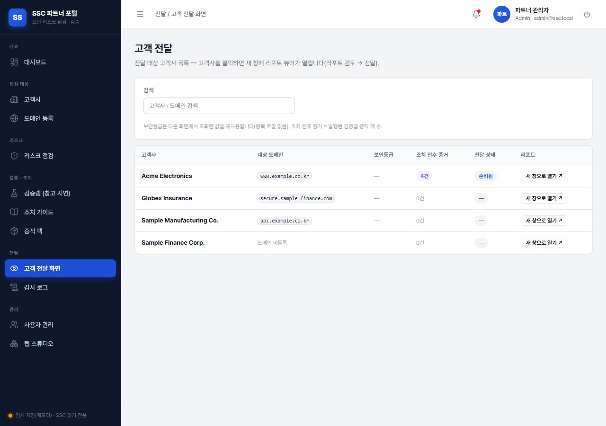

전달 대상 고객사 리스트입니다. 고객사를 클릭하면 **새 창에 리포트 뷰어**가 열립니다. 보안등급은 다른 화면에서 조회한 값을 재사용해 중복 호출하지 않습니다.

- **주요 기능** 고객사 검색 · 보안등급/조치 전후 증거 수 · 행 클릭 → 새 창 리포트 뷰어
- **역할** 조회 `전체`
- **연결** ← 증적 팩 / → 리포트 뷰어(`#report=<고객사>`)
- **Component** `CustomerView` · `src/pages/Pages.jsx`
- **API** sscScore · issueTypeSummary 캐시 재사용

> **리포트 뷰어**(`#report=<고객사>`, 새 창 · 사이드바 없음): 2스텝(리포트 검토 → 전달)으로 우선순위 표 · 이슈 드릴인(조치 전후 증적/가이드) · **증적 재촬영**(전달 시점 실시간 캡처) · PDF 인쇄 · 이메일 전달(mailto)을 제공합니다. `DeliveryReportViewer` · SSC 실 리스크 데이터가 있어야 내용이 채워지므로 데모 캡처에서는 제외했습니다.

---

## SCR-09 · 감사 로그

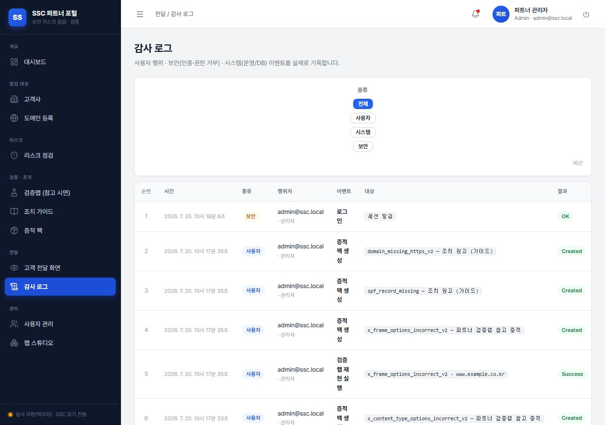

사용자·시스템·보안 이벤트의 **실제 기록**을 조회합니다. 종류별 탭으로 분리하며, 민감값(토큰·비밀번호)은 기록하지 않습니다.

- **주요 기능** 종류 탭(전체/사용자/시스템/보안) · 표(시각·종류·행위자·행위·대상·결과·IP)
- **역할** `admin` 전용
- **연결** ← 대시보드(최근 활동)
- **Component** `AuditLog` · `src/pages/Pages.jsx`
- **API** `GET /api/audit` (`requireAuth` + `requireAdmin`)

---

## SCR-10 · 사용자 관리

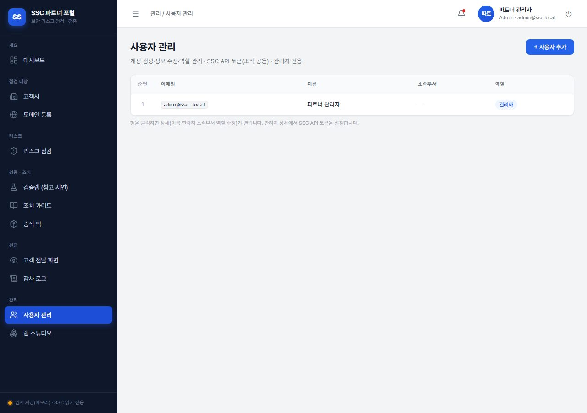

파트너 사용자 계정을 생성하고 역할(admin·partner·viewer)을 변경합니다. 마지막 관리자는 강등할 수 없습니다.

- **주요 기능** 사용자 목록 · 생성 · 역할 변경 · 정보 수정(이름·연락처·부서)
- **역할** `admin` 전용
- **Component** `UsersAdmin` · `src/pages/Pages.jsx`
- **API** `GET/POST/PATCH /api/auth/users`

---

## SCR-11 · 랩 스튜디오

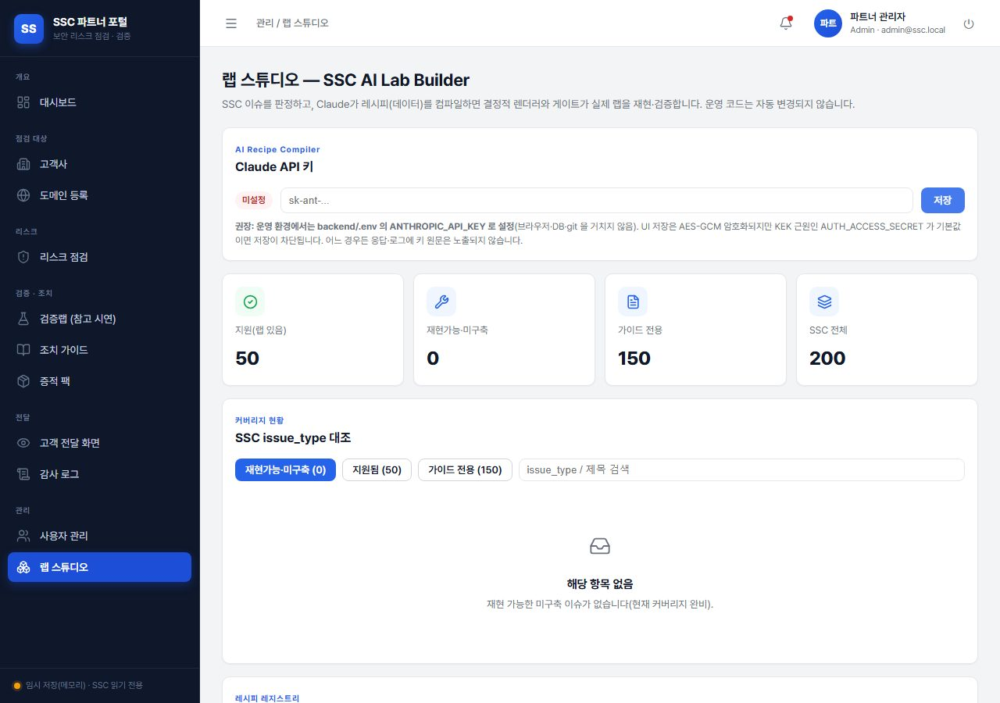

SSC 기반 AI Lab Builder. 커버리지 → 이슈 분류 → 레시피 컴파일 → 검증 게이트 → 채택 순으로 신규 검증랩을 반자동 생성합니다. LLM은 **레시피(JSON 데이터)만** 생성하고 실행 코드는 만들지 않습니다.

- **주요 기능** 커버리지 조회 · 이슈 분류(reuse/extend/needs_infra) · 레시피 컴파일·게이트 · 채택 승인
- **역할** `admin` 전용
- **Component** `LabStudio` · `src/pages/LabStudio.jsx`
- **API** `/api/admin/lab-coverage · lab-classify · lab-recipes/*` · `/api/settings/claude-key`
